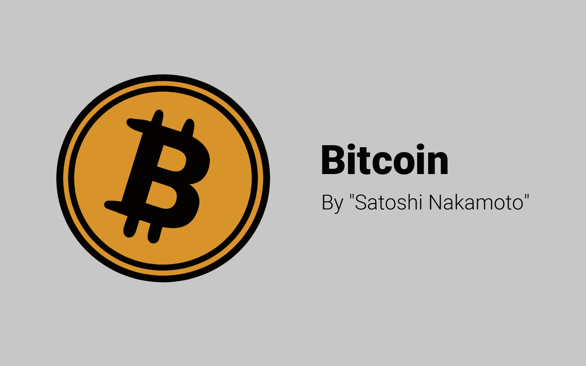

# ⁉️ Bagian -1

## Pendahuluan...

Materi ini sengaja dibuat oleh [**Prof. NOTA**](https://nota.endhonesa.com/) untuk disampaikan pada kegiatan "**Workshop Bitcoin Ordinal bersama SATOSHY ARMI**" yang diselenggarakan di **Discord IDNFT**.

Workshop tersebut diinisiasi oleh **Monimel** dan **Prof. TAWWA** yang kemudian mengajak [**Prof. NOTA**](https://nota.endhonesa.com/) untuk menyusun tutorial ini.

Materi ini juga disampaikan oleh [**Prof. NOTA**](https://nota.endhonesa.com/) di workshop yang diselenggarakan di [**Discord BANANOW.LAND**](https://discord.gg/59p7q8Kqec), yang diinisiasi oleh para **Farmers** dari **BANANOW.LAND**.

<figure><figcaption>
Bitcoin by Satoshi Nakamoto
</figcaption></figure>

Semoga dari penjelasan sederhana ini menghasilkan sesuatu yang bisa membuat setiap kita akan selalu bisa **terTAWWA** ketika disodori sebuah **NOTA**, baik itu **NOTA** tagihan, maupun **NOTA** pembelian.

***

## Penggunaan...

Materi ini terdiri dari beberapa bagian, silahkan dipelajari dengan sebaik-baiknya, dan jika ada pertanyaan atau membutuhkan panduan, silahkan berdiskusi atau menjumpai [**Prof. NOTA**](https://nota.endhonesa.com/) di [**Discord BANANOW.LAND**](https://discord.gg/59p7q8Kqec) atau di [**Discord Prof. NOTA**](https://discord.gg/5KrsT6MbFm).

#### Bagian -1 - Asbab al-Nuzul...

#### Bagian 0 - Berkenalan Dengan [Prof. NOTA](https://nota.endhonesa.com/)...

#### Bagian 1 - Apa Itu Bitcoin Ordinal atau Bitcoin NFT...

#### Bagian 2 - Bagaimana Cara Kerja Bitcoin Ordinal...

#### Bagian 3 - Penutup...

***

N.B. Harap maklum kalau seandainya ada yang kurang tepat dalam penulisan materi ini.\
\
Salam,\
\
[**Prof. NOTA**](https://nota.endhonesa.com/)\
\==== 47 =======

P.S. Read this document freely for information and guidance. Do not redistribute or restate—no quotes, summaries, paraphrases, or derivatives—without prior written permission from [**Prof. NOTA**](https://nota.endhonesa.com/). Sharing the link is allowed. So, share the link, not the text. Do not discuss or re-tell the contents in any form—written, spoken, or recorded—without prior written permission.

***

