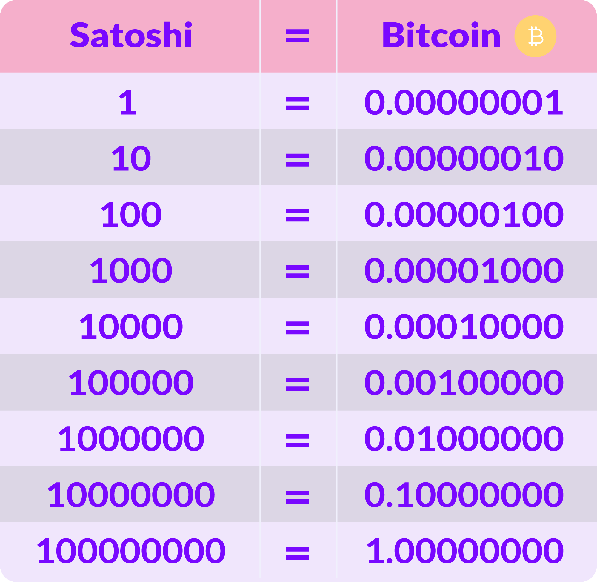
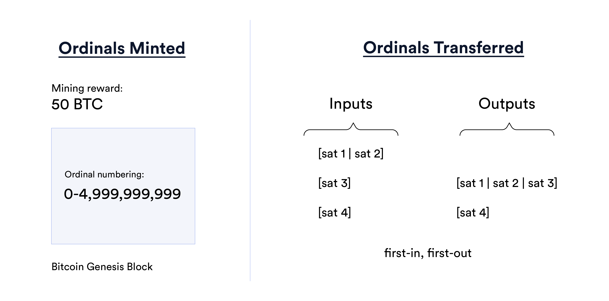
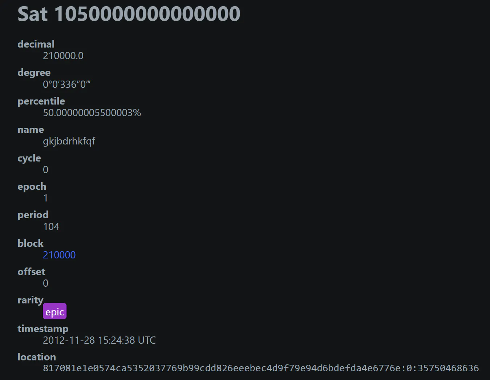

# 📜 Bagian 2

Pertama, mari kita sama-sama berkenalan dengan **Satoshi**, yang sebenarnya bukanlah **Bitcoin**, melainkan sebuah atom, atau debu, yang merupakan mata uang asli dari jaringan blockchain **Bitcoin**. Dibutuhkan 100 juta **Satoshi** untuk menjadi satu **Bitcoin**, atau bisa kita bilang, satu **Bitcoin** sebenarnya dapat dibagi menjadi, atau terdiri dari 100.000.000 **Satoshi**, tidak lebih.

Kedua, mari kita sama-sama berkenalan dengan **Ordinals Theory**, yaitu sebuah teori yang memusatkan perhatian pada **Satoshi**, sehingga bisa mengidentifikasi setiap **Satoshi** dan memungkinkan untuk dilacak, ditransfer, dan diberi makna atau isi.

<figure><figcaption>
1 $BTC = 100.000.000 $SATS (Satoshi)
</figcaption></figure>

Jadi, **Ordinal** itu adalah skema penomoran **Satoshi** yang membuat per masing-masing **Satoshi** bisa dilacak dan ditransfer. Penomoran itu menghasilkan angka-angka yang bisa disebut sebagai nomor urut **Satoshi**.

Scam ah... eh, maaf! Maksudnya, skema. Skema penomoran itu ditentukan berdasarkan urutan ditambangnya (mined/minted), dan urutan ditransfernya, dari input transaksi ke output transaksi (first in first out), yang semuanya bergantung pada urutan, atau **Ordinal Number**.

<figure><figcaption>
Ordinal Number di Bitcoin
</figcaption></figure>

**Ordinal Number** memberikan karunia pada **Satoshi** dengan nilai **numismatik**, sehingga memungkinkan **Satoshi** untuk dikumpulkan dan diperdagangkan sebagai barang antik atau koleksi.


**Numismatik** itu bukan menumis di penggorengan secara otomatis... melainkan sebuah kegiatan mengumpulkan benda-benda terkait uang, seperti uang kertas, uang koin, token, dan benda-benda terkait lainnya yang pernah beredar dan digunakan oleh masyarakat.


Karunia itu diantaranya membuat per masing-masing **Satoshi** memiliki: Kelangkaan, Nama, dan Nilai Eksotik, serta di setiap transaksinya bisa bersifat **Prasasti** (**Inscriptions**).

<figure><figcaption>
Nilai Numismatik Sebuah Satoshi
</figcaption></figure>

Per masing-masing **Satoshi** dapat di-Inscribe dengan konten digital, apapun itu, sehingga menciptakan artefak digital di jaringan blockchain **Bitcoin**. Proses **Inscribe** dilakukan dengan mengirimkan/transfer **Satoshi** dengan tujuan untuk di-**Inscribe** dalam transaksinya, sehingga nantinya bisa menampilkan isi **Inscription**-nya secara on-chain.

<figure><figcaption>
Bitcoin Ordinal Inscription
</figcaption></figure>

Konten digital ini akan terikat erat dengan **Satoshi** yang ditransfer tadi, dan mengubahnya menjadi sebuah artefak digital yang tidak dapat diubah kontennya tapi dapat dilacak, ditransfer menggunakan transaksi di **Bitcoin**, disimpan di wallet **Bitcoin**, dibeli, dijual, bahkan hilang, dan tentunya bisa ditemukan kembali karena sifatnya yang tahan lama, tidak berubah, aman, dan terdesentralisasi di jaringan blockchain **Bitcoin**.

***
